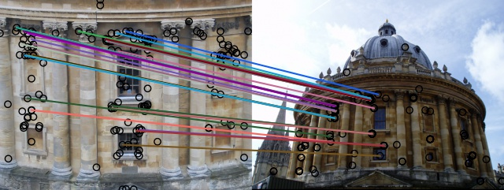

# Installation

Install Python dependencies:

```
pip install -r requirements.txt
```

Set PYTHONPATH:

```
export PYTHONPATH=`pwd`:$PYTHONPATH
```

Set Visible device

```
export CUDA_VISIBLE_DEVICES=1,2,...
```

## Training

Training a delg model:
```
python train_delg.py \
    --cfg configs/config.yaml \
    OUT_DIR /Data_HDD/staff_xi_yang/LYMDataset/output2 \
    PORT 12001 \
    TRAIN.WEIGHTS /Data_HDD/staff_xi_yang/LYMDataset/output2/checkpoints/model_epoch_0068.pyth
```

Resume training: 

```
python train_delg.py \
    --cfg configs/config.yaml \
    OUT_DIR /Data_HDD/staff_xi_yang/LYMDataset/output \
    PORT 12001 \
    TRAIN.AUTO_RESUME True
```

## Feature extraction

Extracting global and local feature for multi-scales
```
python extractor_global.py --cfg configs/config.yaml
```
Refer [`extractor.sh`](tools/extract.sh) for using multicards

See [`visualize.ipynb`](tools/vis/attention/visualize.ipynb) for verification of local features

## Evaluation on ROxf and RPar

### Local Match

- Spatial Verification

    Install [**pydegensac**](https://github.com/ducha-aiki/pydegensac) and see **tools/rerank/spatial_verification.py**

- Examples
<p align="center"></p>

- ASMK
    
    (https://github.com/jenicek/asmk)

### Results 

See (https://github.com/filipradenovic/revisitop) for details

```
cd tools/revisitop
python example_evaluate_with_local.py main
```

cd tools/revisitop
python example_evaluate.py main

- on roxford5k

(None data)

- on rparis6k

The epoch 30 global feature test result on rparis image dataset：
>> rparis6k: mAP E: 26.89, M: 21.89, H: 7.3
>> rparis6k: mP@k[ 1  5 10] E: [72.86 62.67 55.24], M: [77.14 64.57 59.00], H: [24.29 16.57 13.86]
The epoch 30 local feature test result on rparis image dataset：
>> rparis6k: mAP E: 31.15, M: 23.19, H: 7.04
>> rparis6k: mP@k[ 1  5 10] E: [81.43 78.29 71.71], M: [84.29 79.43 73.43], H: [38.57 20.86 16.57]
The epoch 50 global feature test result on rparis image dataset：
>> rparis6k: mAP E: 28.59, M: 21.74, H: 6.56
>> rparis6k: mP@k[ 1  5 10] E: [70.   63.71 56.39], M: [71.43 66.57 60.29], H: [18.57 18.57 16.14]
he epoch 50 local feature test result on rparis image dataset：
>> rparis6k: mAP E: 31.18, M: 22.63, H: 6.36
>> rparis6k: mP@k[ 1  5 10] E: [87.14 76.   70.43], M: [90.   77.71 71.43], H: [22.86 16.86 14.43]


1. SOTA of R50-DELG is 78.3 mAP@M in the paper, we outperform it
2. Traing size, global and local feature scales adopted are same with the paper

### Demo

python Demo.py
